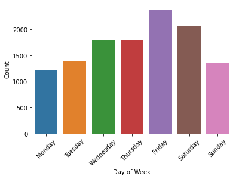
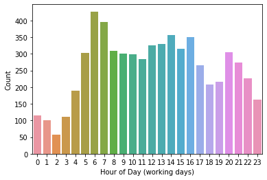
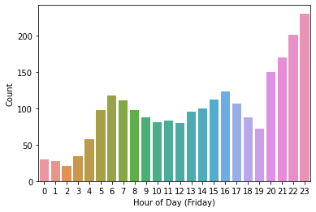
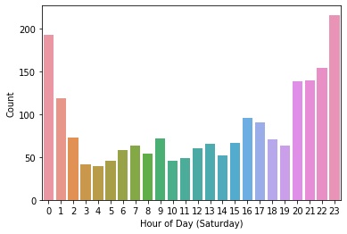
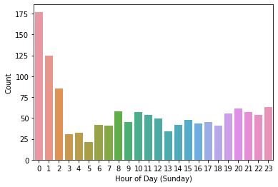
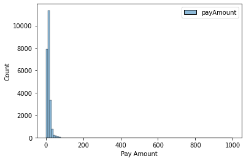
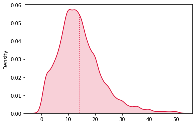
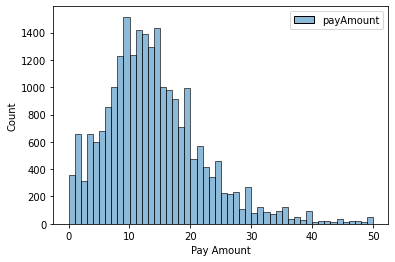

# Service Usage Pattern Analysis
## Introduction
In this repository, you will find a compressed file, 'taxi.json.zip,' containing a dataset spanning two weeks of card transactions within the taxi service industry. This dataset provides insights into the monetary transactions and timing of taxi service purchases. For privacy and security reasons, any personally identifiable information, such as specific locations and provider names, has been redacted.


### Datasets
The dataset includes an array of nested json records and each record contains following inforamtion:

```json
{
  "amount": {
    "value": -1100000,
    "precision": 5,
    "currency": "EUR"
  },
  "transaction_info": {
    "number": 1,
    "machine": null,
    "timestamp": 1621373640000,
    "country": "AT",
    "currency": "EUR",
    "partner": null
  }
}
```

## Requirements

To gain deeper insights into the world of taxi services, this analysis aims to address the following questions:

1. **Peak Usage Patterns:** When are taxi services most frequently utilized, and what factors might elucidate these usage patterns?
2. **Monetary Trends:** What constitutes the typical expenditure on taxi services?

## Solution

This Python-based solution encompasses various stages, beginning with data retrieval from the local directory and culminating in data cleansing, processing, and transformation. The primary objective is to extract valuable insights pertaining to the usage of taxi services.

### Data Preparation

Data cleansing stands as the foremost step in any analytical endeavor. In this context, we load the data into a pandas DataFrame, extract the necessary fields, and subsequently apply requisite transformations. The focus lies on the 'payAmount' and 'timestamp' fields for subsequent analysis. These fields are incorporated into the final DataFrame after flattening the original dataset.


```python
import json
import pandas as pd
with open('taxi.json/taxi.json', 'r') as f:
    data = json.load(f)
# flatten json records
df = pd.json_normalize(data)
# converting unix timestamp to date time format
df['timestamp'] = pd.to_datetime(df['transaction_info.timestamp'], unit='ms')
# adding payAmount column which include absolute float payment by customer using following formula: col(amount.value)/ 10^col(amount.precision)
df['payAmount'] = abs(df['amount.value']/(pow(10,df['amount.precision'])))
transformedDF = df[['payAmount', 'timestamp']]

```

### Usage Time Analysis

To delve into the analysis of usage time patterns for taxi services, several steps were undertaken. Initially, rows with null timestamp values were removed to ensure data integrity. Subsequently, the analysis was approached from two distinct angles: the days of the week with the highest demand and the specific hours of the day when requests peak. Visualizations in the form of frequency distribution plots were created to elucidate usage patterns.

#### Analysis by Day of the Week

1. **Weekend Surge**: The analysis of daily patterns revealed that the highest volume of requests occurred on Fridays and Saturdays. This observation suggests a heightened demand for taxi services during weekends. However, it's important to note that the dataset covers only a two-week period, and further data may be required to draw definitive conclusions.

#### Analysis by Hour of the Day

2. **Weekday Trends**: When examining weekday patterns (from Monday to Thursday), the plots unveiled that the most significant usage spikes transpired at 6 AM and 7 AM. These correspond to the morning rush hours when people typically commute to work.

3. **Friday Night Lights**: On Fridays, a distinctive usage pattern emerged with the highest demand occurring during the late evening hours. This aligns with the onset of weekend activities when people venture out for entertainment.

4. **Saturday Adventures**: Saturdays exhibited a dual-peaked pattern. The initial surge in demand materialized during the early morning hours (12 AM and 1 AM), likely reflecting individuals returning from nighttime outings. A subsequent spike was observed from 8 PM to 11 PM, indicating evening activities.

5. **Sunday Mornings**: Sundays showcased heightened usage in the early morning hours, which can be attributed to individuals returning home after weekend gatherings. In contrast to Saturdays, there was no notable surge in demand during the late hours, possibly due to the impending workweek.

These analyses provide valuable insights into the temporal usage patterns of taxi services. However, it's essential to consider the dataset's limited timeframe when interpreting these findings.


```python
import seaborn as sns
import matplotlib.pyplot as plt

# drop records whitout timestamp
dfDropedTimestampNa = transformedDF[['timestamp']].dropna()

# extract day of week and hour from timestamp column and adding them to original dataframe
dfDropedTimestampNa['dayofweek'] = dfDropedTimestampNa['timestamp'].dt.dayofweek
dfDropedTimestampNa['hour'] = dfDropedTimestampNa['timestamp'].dt.hour

# plotting count plot of day of week and hour (based on working days and weekend) using seaborn for futher analysis
ax = sns.countplot(x='dayofweek', data=dfDropedTimestampNa)
ax.set(xlabel='Day of Week', ylabel='Count')
ax.set(xticklabels = (['Monday', 'Tuesday', 'Wednesday', 'Thursday', 'Friday', 'Saturday', 'Sunday']))
plt.xticks(rotation=45)
plt.show()

ax = sns.countplot(x='hour', data=dfDropedTimestampNa[dfDropedTimestampNa['dayofweek']<=3])
ax.set(xlabel='Hour of Day (working days)', ylabel='Count')
plt.show()

ax = sns.countplot(x='hour', data=dfDropedTimestampNa[dfDropedTimestampNa['dayofweek']==4])
ax.set(xlabel='Hour of Day (Friday)', ylabel='Count')
plt.show()

ax = sns.countplot(x='hour', data=dfDropedTimestampNa[dfDropedTimestampNa['dayofweek']==5])
ax.set(xlabel='Hour of Day (Saturday)', ylabel='Count')
plt.show()

ax = sns.countplot(x='hour', data=dfDropedTimestampNa[dfDropedTimestampNa['dayofweek']==6])
ax.set(xlabel='Hour of Day (Sunday)', ylabel='Count')
plt.show()


```


<p align="center">
  
</p>

<p align="center">
  
</p>

    
<p align="center">
  
</p>

<p align="center">
  
</p>

<p align="center">
  
</p>

    


### Pay Amount Analysis

In the pursuit of analyzing pay amounts within the dataset, a step-by-step approach was adopted. Initially, a frequency distribution plot for the pay amount column was generated to gain a broad understanding of the data. This initial plot revealed the presence of outlier values, which had a substantial impact on the mean value.

#### Initial Analysis

1. **Outlier Identification**: The initial frequency distribution plot highlighted the existence of outlier values, significantly skewing the dataset's mean value.

2. **Outlier Removal**: To mitigate the influence of outliers, a filtering process was employed to retain only those values below 50. This approach effectively trimmed the dataset, removing the extreme outliers.

#### Refined Analysis

3. **Post-Filtering Analysis**: Following the removal of outliers, a subsequent frequency distribution plot was created. This refined plot portrayed a distribution of pay amounts that more closely resembled a Gaussian distribution.

4. **Typical Amount Estimation**: The mean value, calculated as 14.206391 after the removal of outliers, can be regarded as the typical amount of money spent on taxi services. This value provides a more representative measure of central tendency for the dataset.

This analysis not only sheds light on the typical expenditure on taxi services but also demonstrates the impact of outliers on statistical measures, emphasizing the importance of data preprocessing in drawing meaningful insights.


```python
import seaborn as sns
import matplotlib.pyplot as plt
import numpy as np


def frequency_distribution(df:pd.DataFrame, col:str):
    """
    A user-defined function to plot histogram of input column of dataframe

    Parameters:
        df (pd.dataFrame): a dataFrame that is a source for calculating.
        col : column name to plot histogram
    Output:

    Returns:
        None
    """
    x = df[col][df[col] >= 0].to_numpy()
    ax = sns.kdeplot(x, shade=False, color='crimson')
    kdeline = ax.lines[0]
    mean = x.mean()
    xs = kdeline.get_xdata()
    ys = kdeline.get_ydata()
    height = np.interp(mean, xs, ys)
    ax.vlines(mean, 0, height, color='crimson', ls=':')
    ax.fill_between(xs, 0, ys, facecolor='crimson', alpha=0.2)
    plt.show()
print('Data description:')
display(transformedDF.describe())


# bar plot frequncy distribution of payment amount column to find an overview of entire data distribution
ax = sns.histplot(transformedDF,kde=False, bins=100,color='#607c8e')
ax.set(xlabel='Pay Amount', ylabel='Count')
plt.show()

print('Data description After removing outliers:')
display(transformedDF[transformedDF['payAmount']<=50].describe())

# plot Density base and bar graph distribution of payment column on a sub set of data to have better understanding of data (removing outliers)
frequency_distribution(transformedDF[transformedDF['payAmount']<=50], 'payAmount')
plt.show()

ax = sns.histplot(transformedDF[transformedDF['payAmount']<=50],kde=False, bins=50,color='#607c8e')
ax.set(xlabel='Pay Amount', ylabel='Count')
plt.show()

```

    Data description:


<div>
<style scoped>
    .dataframe tbody tr th:only-of-type {
        vertical-align: middle;
    }

    .dataframe tbody tr th {
        vertical-align: top;
    }

    .dataframe thead th {
        text-align: right;
    }
</style>
<table border="1" class="dataframe">
  <thead>
    <tr style="text-align: right;">
      <th></th>
      <th>payAmount</th>
    </tr>
  </thead>
  <tbody>
    <tr>
      <th>count</th>
      <td>23867.000000</td>
    </tr>
    <tr>
      <th>mean</th>
      <td>15.154479</td>
    </tr>
    <tr>
      <th>std</th>
      <td>15.309014</td>
    </tr>
    <tr>
      <th>min</th>
      <td>0.010000</td>
    </tr>
    <tr>
      <th>25%</th>
      <td>8.900000</td>
    </tr>
    <tr>
      <th>70%</th>
      <td>13.030000</td>
    </tr>
    <tr>
      <th>75%</th>
      <td>18.725000</td>
    </tr>
    <tr>
      <th>max</th>
      <td>1000.000000</td>
    </tr>
  </tbody>
</table>
</div>


 <p align="center">
  
</p>
   
    


    Data description After removing outliers:


<div>
<style scoped>
    .dataframe tbody tr th:only-of-type {
        vertical-align: middle;
    }

    .dataframe tbody tr th {
        vertical-align: top;
    }

    .dataframe thead th {
        text-align: right;
    }
</style>
<table border="1" class="dataframe">
  <thead>
    <tr style="text-align: right;">
      <th></th>
      <th>payAmount</th>
    </tr>
  </thead>
  <tbody>
    <tr>
      <th>count</th>
      <td>23548.000000</td>
    </tr>
    <tr>
      <th>mean</th>
      <td>14.206391</td>
    </tr>
    <tr>
      <th>std</th>
      <td>8.151394</td>
    </tr>
    <tr>
      <th>min</th>
      <td>0.010000</td>
    </tr>
    <tr>
      <th>25%</th>
      <td>8.800000</td>
    </tr>
    <tr>
      <th>70%</th>
      <td>13.000000</td>
    </tr>
    <tr>
      <th>75%</th>
      <td>18.300000</td>
    </tr>
    <tr>
      <th>max</th>
      <td>50.000000</td>
    </tr>
  </tbody>
</table>
</div>


<p align="center">
  
</p>

<p align="center">
  
</p>

    
